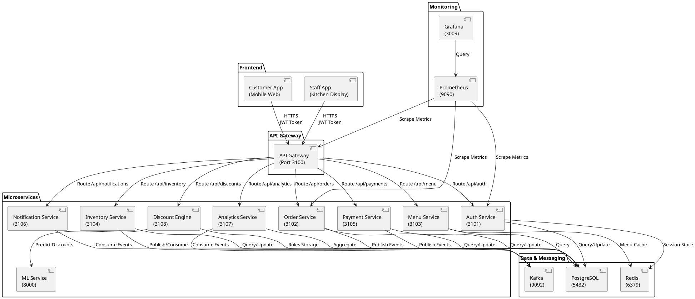
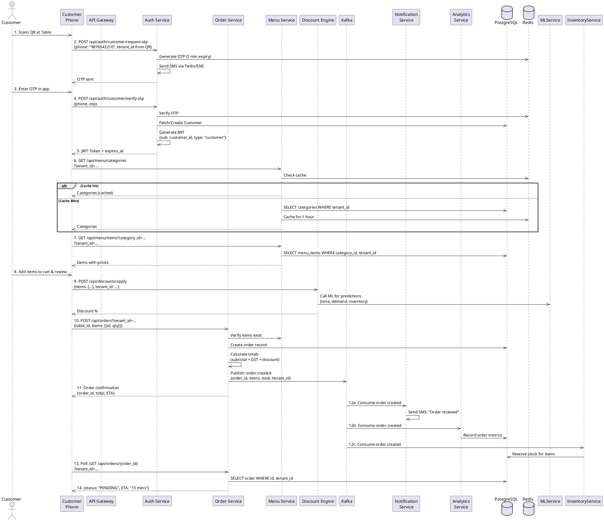
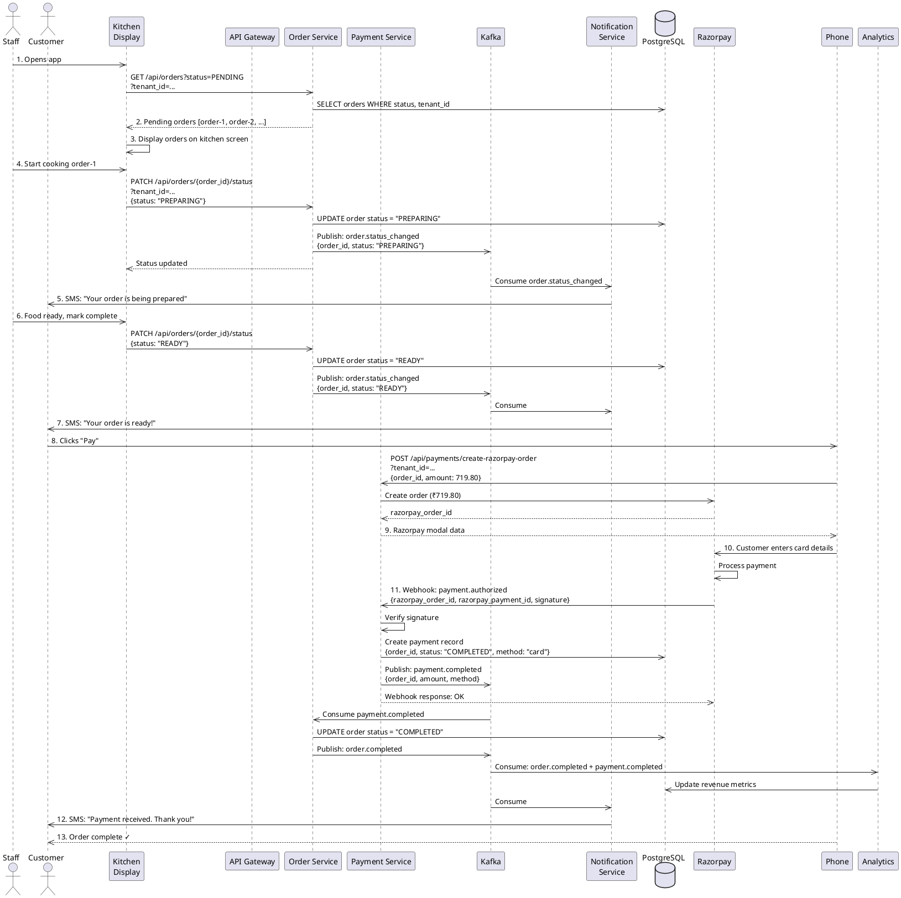
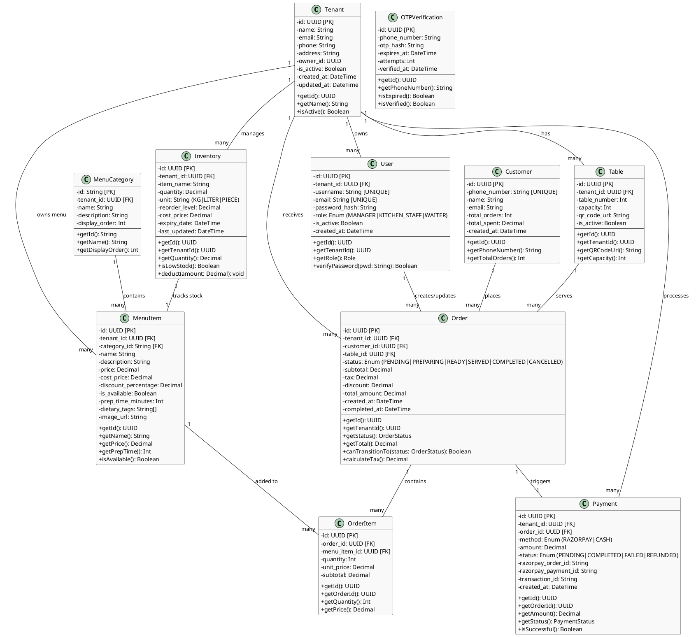
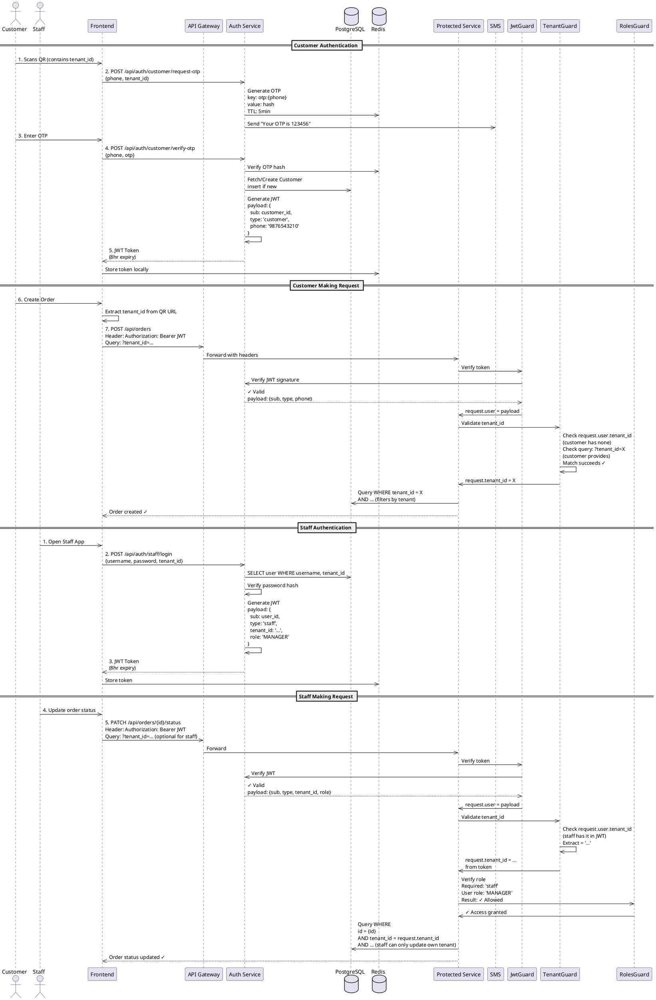
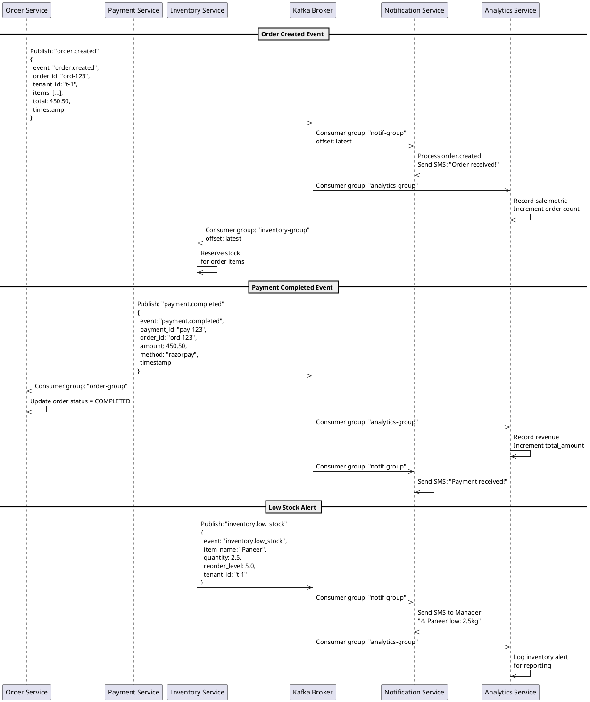
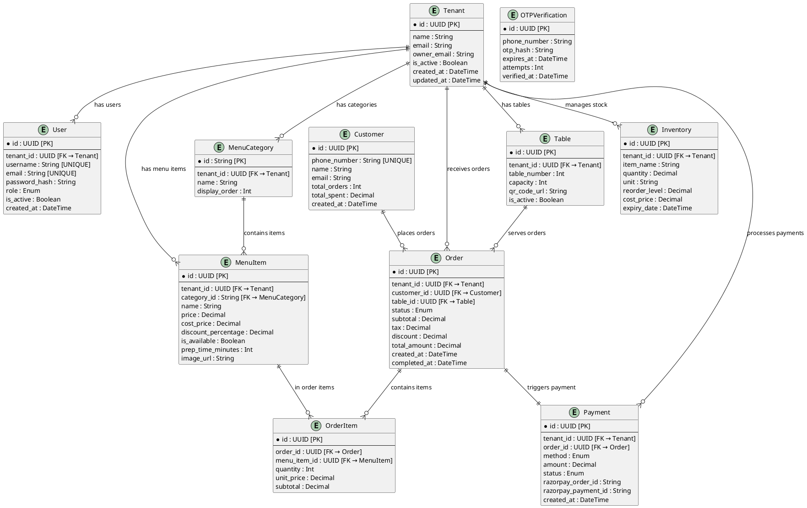

# IntelliDine — UML Diagrams & Architecture

This document contains comprehensive UML diagrams for the IntelliDine system, including system collaboration, sequence diagrams, and class diagrams.

---

## 1. System Collaboration Diagram (Component Overview)



---

## 2. Customer Order Creation Sequence Diagram



---

## 3. Order Preparation & Payment Sequence Diagram



---

## 4. Core Entity Class Diagram



---

## 5. Service Architecture & Dependencies Diagram

```plantuml
@startuml Service_Dependencies
skinparam componentBackgroundColor #e1f5ff
skinparam componentBorderColor #01579b

package "Core Services" {
  component [Auth Service] as Auth {
    - JWT Generation
    - OTP Management
    - Session Management
  }
  
  component [Menu Service] as Menu {
    - Menu Browsing
    - Category Management
    - Item Availability
  }
  
  component [Order Service] as Order {
    - Order Creation
    - Status Management
    - Order History
  }
}

package "Business Services" {
  component [Payment Service] as Payment {
    - Razorpay Integration
    - Cash Handling
    - Payment Tracking
  }
  
  component [Inventory Service] as Inventory {
    - Stock Management
    - Low Stock Alerts
    - Deduction on Order
  }
  
  component [Discount Engine] as Discount {
    - Pricing Rules
    - ML Predictions
    - Promotion Logic
  }
}

package "Supporting Services" {
  component [Notification Service] as Notif {
    - SMS/Email Alerts
    - Order Updates
    - Real-time WebSocket
  }
  
  component [Analytics Service] as Analytics {
    - Metrics Collection
    - Trend Analysis
    - Reporting
  }
}

package "ML & Intelligence" {
  component [ML Service] as ML {
    - Discount Prediction
    - Demand Forecasting
    - Anomaly Detection
  }
}

' Dependencies
Auth --|> Auth: exports JwtGuard\nTenantGuard\nSharedAuthModule

Order --> Auth: uses JwtGuard\nTenantGuard
Order --> Menu: verifies items
Order --> Inventory: reserves stock
Order ..> Discount: queries discount
Order ..> Kafka: publishes\norder.created\norder.status_changed

Payment --> Auth: uses JwtGuard\nTenantGuard
Payment ..> Kafka: publishes\npayment.completed

Inventory --> Auth: uses JwtGuard
Inventory ..> Kafka: publishes\ninventory.low_stock\nconumes order.created

Menu --> Auth: uses JwtGuard
Menu --> Redis: caches menu

Discount --> ML: calls for predictions
Discount --> Auth: uses JwtGuard

Notif ..> Kafka: consumes all events
Notif --> Auth: uses JwtGuard

Analytics ..> Kafka: consumes all events
Analytics --> Auth: uses JwtGuard

' External Dependencies
Payment --> Razorpay: webhook\nverification

Auth --> Redis: session storage\nOTP cache

Auth --> SMS: Twilio/SNS

Order --> DB: persistence
Payment --> DB: persistence
Inventory --> DB: persistence
Menu --> DB: persistence
Analytics --> DB: aggregation

@enduml
```

---

## 6. Authentication & Authorization Flow Diagram



---

## 7. Kafka Event-Driven Architecture Diagram



---

## 8. Database Schema Relationship Diagram



---

## Key Architectural Insights

### Multi-Tenancy Pattern
- **Tenant ID enforcement**: Every table, query, and operation is filtered by `tenant_id`
- **Data isolation**: Complete separation at application layer (not database level)
- **Staff vs. Customer**: Staff JWT contains `tenant_id`; customers pass it in request

### Authentication Strategy
```
┌─────────────────────────────────────────┐
│       Customer Authentication           │
├─────────────────────────────────────────┤
│ 1. Scan QR → Extract tenant_id from URL │
│ 2. Request OTP via phone                │
│ 3. Verify OTP → Get JWT (no tenant_id)  │
│ 4. Include tenant_id in subsequent reqs │
└─────────────────────────────────────────┘

┌─────────────────────────────────────────┐
│        Staff Authentication             │
├─────────────────────────────────────────┤
│ 1. Login with username/password         │
│ 2. Specify tenant_id (for multi-tenant) │
│ 3. Verify credentials against DB        │
│ 4. Get JWT with tenant_id + role claim  │
│ 5. Tenant_id auto-extracted from JWT    │
└─────────────────────────────────────────┘
```

### Event-Driven Decoupling
- Services don't call each other directly
- All cross-service communication via Kafka topics
- Loose coupling enables independent scaling

### Guard & Middleware Chain
```
Request → JwtGuard (verify token) → TenantGuard (validate tenant_id) 
  → RolesGuard (check permissions) → Service Logic
```

---

## Rendering These Diagrams

**Option 1: Online PlantUML Viewer**
- Visit: http://www.plantuml.com/plantuml/uml/
- Paste the PlantUML code above

**Option 2: VS Code PlantUML Extension**
- Install: `jebbs.plantuml`
- Open this file and right-click → Show PlantUML Preview

**Option 3: Local PlantUML CLI**
```bash
sudo apt-get install plantuml
plantuml -o /tmp DOCUMENTATION/UML_DIAGRAMS.md
```

**Option 4: Generate as SVG/PNG**
```bash
plantuml -tsvg DOCUMENTATION/UML_DIAGRAMS.md
```

---

**Generated**: November 6, 2025  
**Last Updated**: November 6, 2025  
**Format**: PlantUML (ASCII UML - version control friendly)
